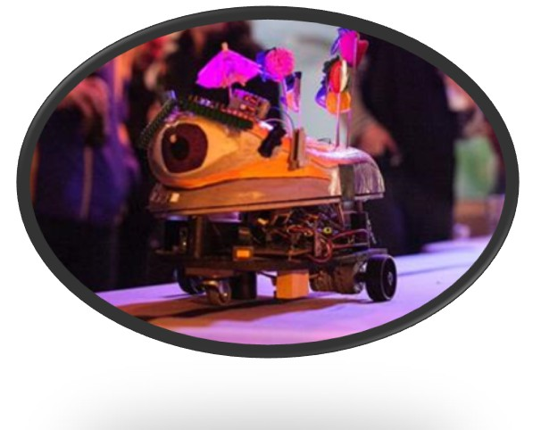

# Gaston

Gaston is a cocktail serving roboter on wheels which is delighted to offer safe transportation of your beverage of choice right to your seat.
 
## Features

* Follows a line with several stops marked by RFID tags
* Plays Music from a SD-card
* Accepts orders of different kinds of cocktails via selection buttons
* Communicates with delivery station via infrared signals 
* RGB LED strip for outstanding light-effects and cocktail indication
* RFID-Sensor for determining table position and base 
* Rechargeable battery

## Operation:
Gaston patrols between different stations along the line (where guests can place orders). He will wait for about ten seconds at each station, and then proceed to the next. At the last station, Gaston makes a U-turn and travels back to the first station. 

To choose a desired cocktail, place an empty glass (!) in the glass holder. 
Then press the white button to choose a desired cocktail. The colour indicates a specific mixture. For confirmation, press the green button. Gastón will then head towards the delivery station, get your drink and (hopefully) come back.

## Sensor Calibration:
The surface should reflect IR-light better than the line. Non-reflecting black tape on a white surface works well. To calibrate the sensor settings for a particular surface/line material, place the robot on the surface, and hold the white button while switching power on. Next, place Gastón on the darker line and press the green button. After a fitting threshold is calculated and stored, Gastón will start moving.

## More infos about build and programming:
see: (doc/Documentation.doc)

